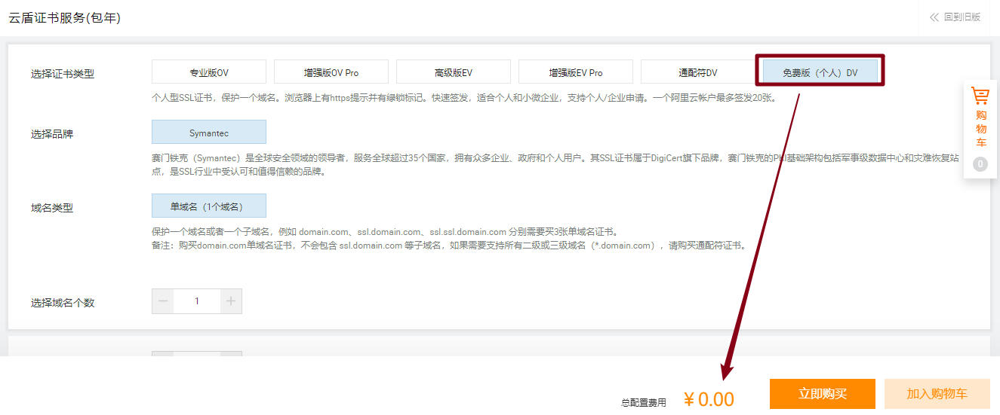
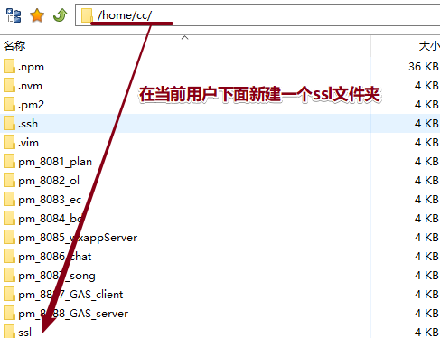

# Https

* 先有http服务；域名、Nginx、node服务全部配置成功；
* 阿里云SSL证书管理：`https://yundun.console.aliyun.com/?spm=5176.2020520154.products-recent.dcas.6cf3tUshtUshnH&p=cas#/overview/cn-hangzhou`

* 购买证书：


* 选择个人版DV



* 购买完成后，会出现一个未签发的证书，点击


* 信息填入，自动DNS验证


* 验证通过后，证书下载


* 下载解压完成后，会有两个文件：


* 看帮助文档：


* 将下载的文件通过FTP上传到服务器上：




* 修改nginx配置：


* 发生改变的部分：


* 文件部分：重启Nginx `sudo nginx -s reload`

```cmd
upstream wxapp {
    server 127.0.0.1:8085;
}
server {
    listen 80;
    server_name wxapp.armincc.com;
    rewrite ^(.*)$ https://$host$1 permanent;   #将所有http请求通过rewrite重定向到https。
}
server {
    listen 443;
    server_name wxapp.armincc.com;
    ssl on;
    ssl_certificate /home/cc/ssl/8085_wxapp/3548822_wxapp.armincc.com.pem;
    ssl_certificate_key /home/cc/ssl/8085_wxapp/3548822_wxapp.armincc.com.key;
    ssl_session_timeout 5m;
    ssl_protocols TLSv1 TLSv1.1 TLSv1.2;
    ssl_ciphers ECDHE-RSA-AES128-GCM-SHA256:ECDHE:ECDH:AES:HIGH:!NULL:!aNULL:!MD5:!ADH:!RC4;
    ssl_prefer_server_ciphers on;


    location / {
        proxy_set_header X-Real-IP $remote_addr;
        proxy_set_header X-Forward-For $proxy_add_x_forwarded_for;
        proxy_set_header Host $http_host;
        proxy_set_header X-Nginx-Proxy true;

        proxy_pass http://wxapp;
        proxy_redirect off;

    }
}

```

